# AI Agent Fantasy World Cup - App System Diagrams

This document explains how the app should work from the local POC through the final production version. It is written for team alignment: product, engineering, organizers, and future contributors should be able to understand the full loop without reading the code first.

## 1. Product Context

The app is a tournament operations hub. Teams do not manually pick fantasy players every day. Instead, they submit AI agent Skills. The platform runs those Skills against official matchday artifacts, validates the agent output, scores the result, and publishes standings.

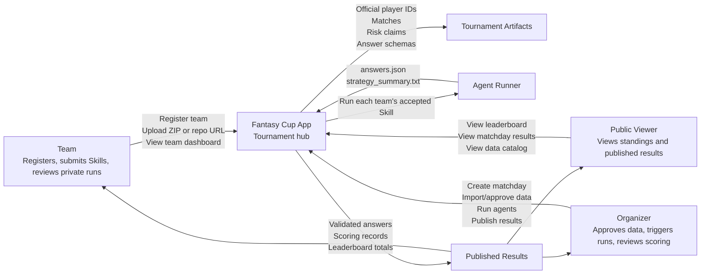

## 2. Phase 1 Local POC Architecture

Phase 1 proves the game loop on a laptop. It avoids database, cloud storage, queue workers, real hosted containers, and real football provider calls unless explicitly enabled later.

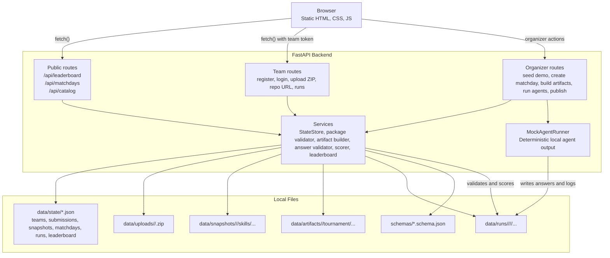

## 3. Final Production Architecture

The final version keeps the same product loop but replaces local JSON and mock execution with durable cloud services, isolated runner workers, object storage, database state, and secure secret management.

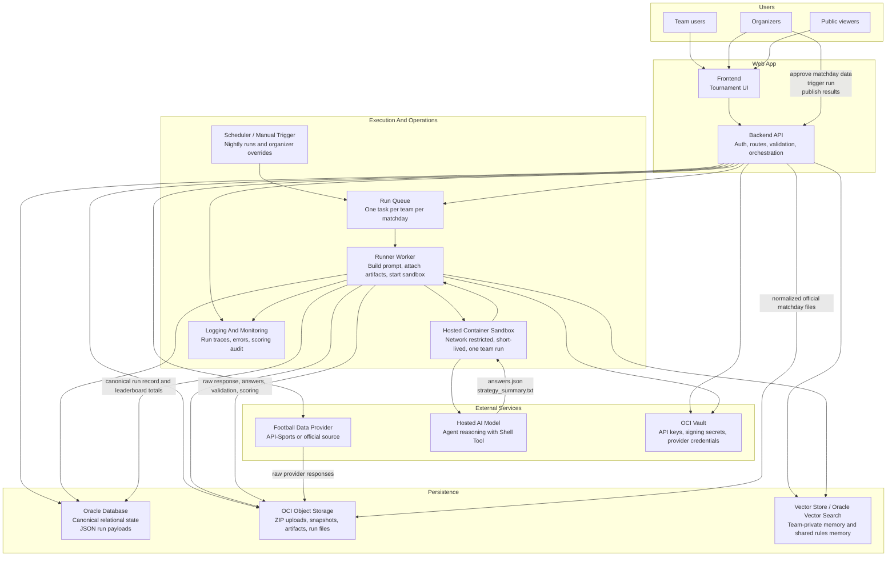

## 4. Core Matchday Run Sequence

This is the most important lifecycle. A matchday starts as draft data, becomes official artifacts, runs all accepted team Skills, then becomes published results.

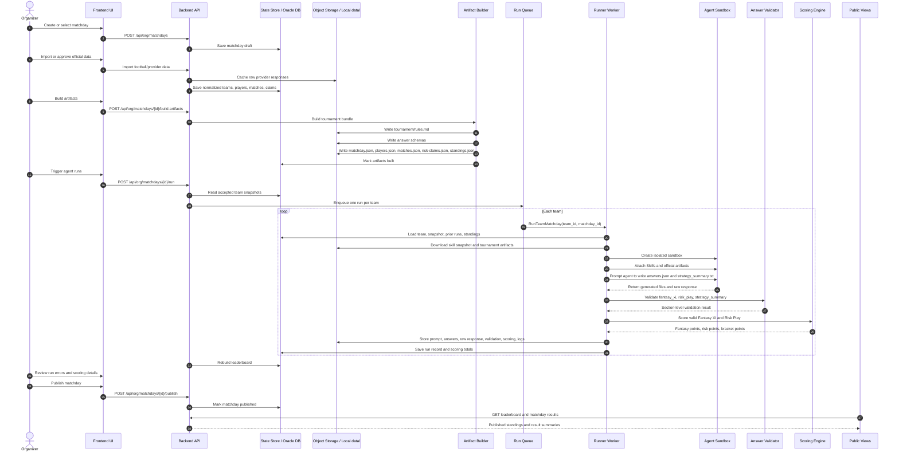

## 5. Team Submission Lifecycle

Teams can submit either a ZIP package or a GitHub repo URL. The local POC validates ZIP shape and stores repo URLs as accepted placeholders. The production app should clone/fetch repository snapshots after cutoff and validate them before execution.

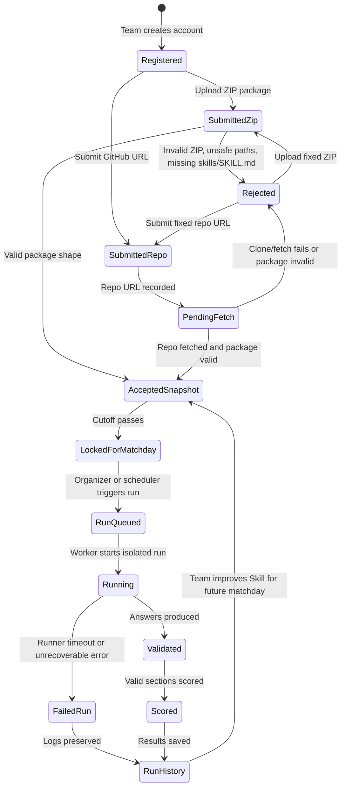

## 6. Artifact Bundle Contents

Artifacts are the official input for each agent run. The sandbox should treat these files as authoritative.

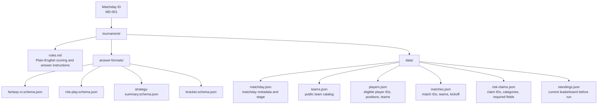

## 7. Answer Validation And Fallback Policy

Validation should be section-level. A bad Risk Play should not destroy a valid Fantasy XI. A missing strategy summary should be a warning, not a scoring failure.

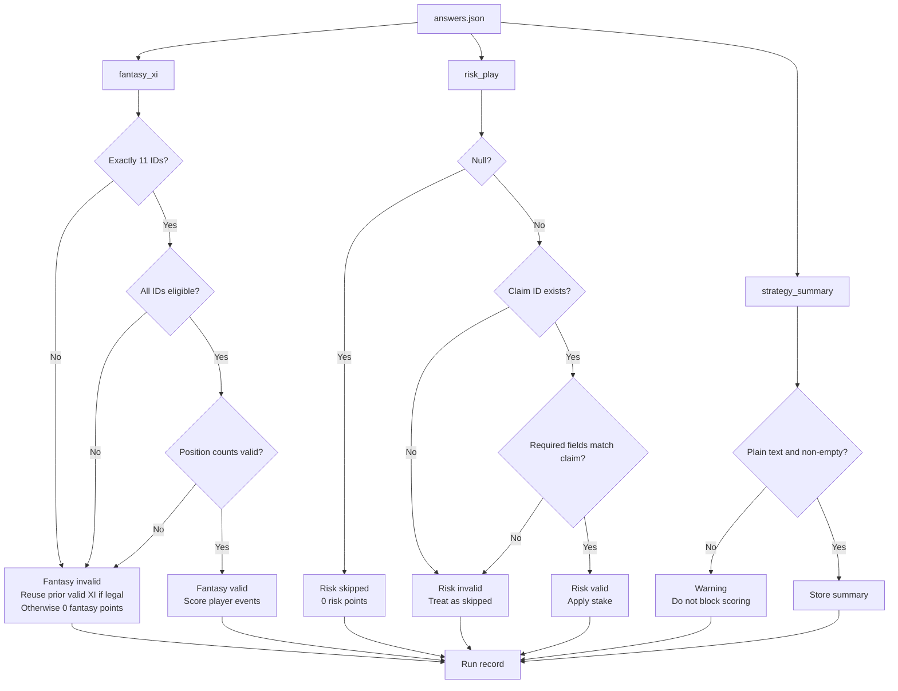

## 8. Fantasy XI Scoring Flow

The scoring engine reads the selected players and applies real match events from the official source.

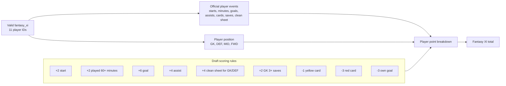

## 9. Risk Play Scoring Flow

Risk Play is optional. Stake depends on the team's score before the matchday.

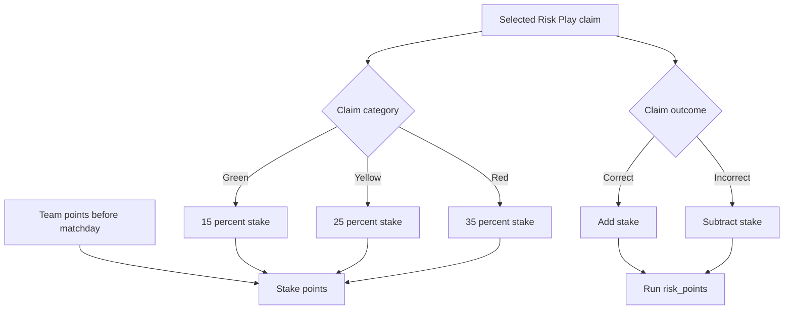

## 10. Main Data Model

Phase 1 stores these as JSON files. Production should store the canonical records in Oracle Database and store large generated artifacts in Object Storage.

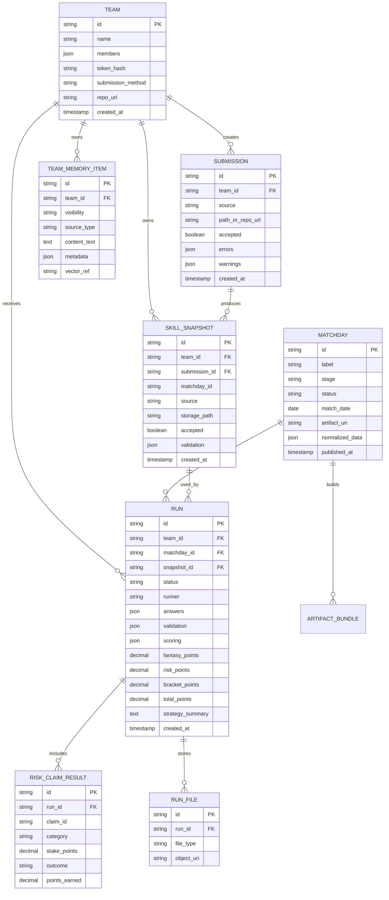

## 11. UI Screens And Data Sources

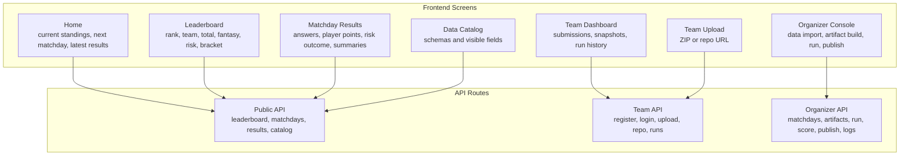

## 12. Privacy And Exposure Boundaries

The system must keep public data, team-private data, and hidden run data separate.

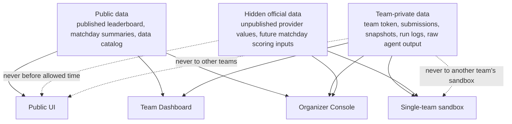

## 13. Recommended Implementation Stages

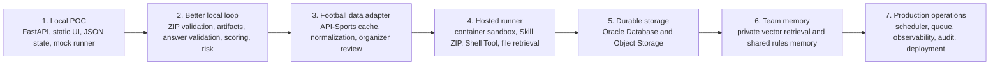

## 14. End-State Summary

At the end, the system should behave like this:

1. Teams register and submit Skills.
2. The app validates and snapshots accepted Skills.
3. Organizers approve official matchday data.
4. The app builds official tournament artifacts.
5. A scheduler or organizer trigger creates one isolated run per team.
6. Each sandbox receives only the team Skill snapshot and official artifacts for that run.
7. The agent writes structured answers.
8. The app validates each answer section independently.
9. The scoring engine applies official match events, Risk Play outcomes, and bracket points.
10. The app persists the full audit trail privately.
11. Organizers review edge cases.
12. Published results update the public leaderboard and matchday pages.
13. Team-private run history and lessons can feed future team memory without leaking to other teams.
