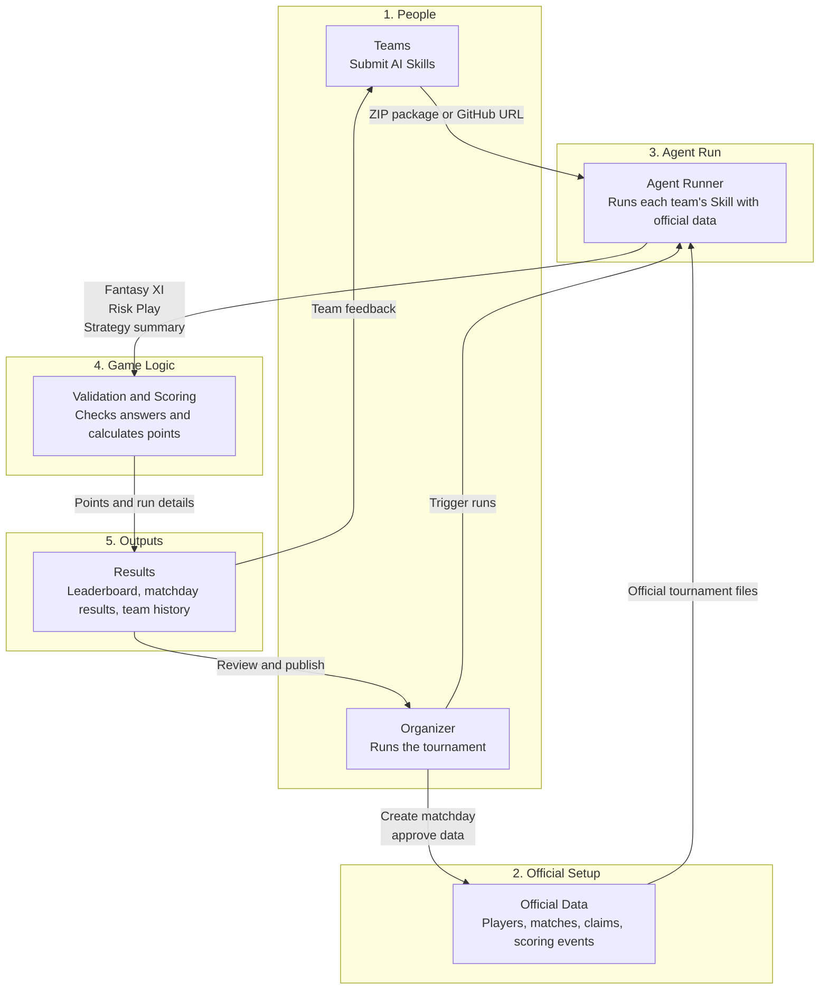

# Main Modules - Simple View

This is the simplest way to explain the app. The platform has six main modules. Each one has a clear job, and together they create the tournament loop.

## What Each Module Does

### 1. Teams

Teams are the competitors. They register in the app and submit AI Skills. A Skill is the team's strategy written as instructions or code-like guidance for an agent.

In the local POC, teams can submit:

- A ZIP package with a `skills/` folder.
- A GitHub repository URL.

### 2. Organizer

The organizer runs the tournament. They create matchdays, prepare official data, run the agents, review problems, and publish results.

The organizer is the human control point for anything that should not be fully automatic yet.

### 3. Official Data

Official data is the source of truth for each matchday. It tells every agent what IDs and formats are valid.

It includes:

- Eligible players.
- Matches.
- Teams.
- Risk Play claims.
- Answer schemas.
- Scoring events.

### 4. Agent Runner

The runner executes each team's accepted Skill against the official data.

For phase 1, this is a mock runner so we can prove the app flow quickly.

Later, this becomes an isolated hosted container where each team's agent runs safely on its own.

### 5. Validation And Scoring

This module checks the agent's answer and calculates points.

It validates:

- Fantasy XI has exactly 11 eligible players.
- Positions follow the rules.
- Risk Play uses a valid claim.
- Strategy summary exists.

Then it scores:

- Player events.
- Risk Play stake.
- Bracket points later.

### 6. Results

Results are what everyone sees after the run.

Public viewers see:

- Leaderboard.
- Published matchday results.
- Rules and data catalog.

Teams see:

- Their own run history.
- Their validation errors.
- Their strategy summaries.

Organizers see:

- Logs.
- Scoring details.
- Edge cases to review.

## Short Version

Teams submit strategy. Organizers prepare official data. The runner asks each team's AI agent for answers. The app validates and scores those answers. The results become the leaderboard.
