# System Overview

This overview shows the full intended system in one diagram. It includes the local POC pieces that exist now and the production pieces planned for the final tournament platform.

```mermaid
flowchart TB
  subgraph People["People And Access"]
    PublicViewer["Public Viewer<br/>Reads standings, matchday results, rules, data catalog"]
    TeamUser["Team User<br/>Registers team, submits Skills, reviews private run history"]
    Organizer["Organizer<br/>Approves data, triggers runs, reviews scoring, publishes results"]
  end

  subgraph Frontend["Frontend - Static App"]
    Home["Home<br/>current standings, next matchday, latest published results"]
    Leaderboard["Leaderboard<br/>rank, total points, fantasy points, risk record, bracket points"]
    Results["Matchday Results<br/>team answers, player points, risk outcome, strategy summary"]
    Catalog["Data Catalog<br/>visible fields, schemas, scoring rules, answer formats"]
    TeamDashboard["Team Dashboard<br/>submission status, snapshots, run history, validation errors"]
    TeamUpload["Team Upload<br/>ZIP package or GitHub repository URL"]
    OrganizerConsole["Organizer Console<br/>seed demo, create matchday, build artifacts, run agents, publish"]
  end

  subgraph API["Backend API - FastAPI"]
    PublicAPI["Public API<br/>GET leaderboard<br/>GET matchdays<br/>GET results<br/>GET catalog"]
    TeamAPI["Team API<br/>register<br/>login with token<br/>upload ZIP<br/>register repo URL<br/>read team runs"]
    OrganizerAPI["Organizer API<br/>create matchday<br/>import or approve data<br/>build artifacts<br/>run agents<br/>score<br/>publish<br/>read logs"]
  end

  subgraph CoreServices["Core Services"]
    Config["Config Loader<br/>.env for secrets<br/>configs.yaml for safe defaults"]
    StateStore["State Store<br/>local JSON now<br/>Oracle Database later"]
    PackageValidator["Skill Package Validator<br/>checks ZIP shape<br/>requires skills/*/SKILL.md<br/>blocks unsafe paths<br/>warns on secret-like files"]
    ArtifactBuilder["Artifact Builder<br/>creates official tournament bundle"]
    RunnerSelector["Runner Selector<br/>MockAgentRunner now<br/>HostedContainerRunner later"]
    AnswerValidator["Answer Validator<br/>Fantasy XI rules<br/>Risk Play claim rules<br/>Strategy summary rules<br/>Bracket lock later"]
    Scorer["Scoring Engine<br/>Fantasy XI points<br/>Risk stake points<br/>Bracket points later"]
    LeaderboardService["Leaderboard Service<br/>latest run per team and matchday<br/>ranked public totals"]
    PrivacyGuard["Privacy Boundary<br/>public data vs team-private data vs hidden run data"]
  end

  subgraph LocalStorage["Phase 1 Local Files"]
    JSONFiles["data/state/*.json<br/>teams, submissions, snapshots, matchdays, runs, leaderboard"]
    Uploads["data/uploads/<team_id>/<submission>.zip"]
    Snapshots["data/snapshots/<team_id>/<snapshot_id>/skills/..."]
    Artifacts["data/artifacts/<matchday_id>/tournament/..."]
    RunFiles["data/runs/<matchday_id>/<team_id>/<run_id>/...<br/>prompt, answers, raw response, validation, scoring, logs"]
    Schemas["schemas/*.schema.json<br/>fantasy-xi, risk-play, strategy-summary, bracket"]
  end

  subgraph TournamentBundle["Official Tournament Artifacts"]
    Rules["rules.md"]
    AnswerFormats["answer-formats/*.schema.json"]
    MatchdayData["data/matchday.json"]
    TeamsData["data/teams.json"]
    PlayersData["data/players.json"]
    MatchesData["data/matches.json"]
    RiskClaimsData["data/risk-claims.json"]
    StandingsData["data/standings.json"]
  end

  subgraph AgentExecution["Agent Execution"]
    MockRunner["Mock Agent Runner<br/>deterministic local answers for POC"]
    HostedRunner["Hosted Container Runner<br/>future isolated sandbox"]
    TeamSkills["Team Skill Snapshot<br/>submitted Markdown Skills and optional assets"]
    Sandbox["One-Team Sandbox<br/>receives only that team's Skills and official artifacts"]
    AgentOutput["Agent Output<br/>answers.json<br/>strategy_summary.txt<br/>raw_response.json<br/>logs.txt"]
  end

  subgraph FootballData["Football Data"]
    MockData["Mock Matchday Data<br/>phase 1 playable demo"]
    ProviderAPI["API-Sports or Official Provider<br/>fixtures, teams, players, lineups, events, stats"]
    NormalizedData["Normalized Official Data<br/>eligible players, matches, risk claims, scoring events"]
    OrganizerReview["Organizer Review<br/>patch ambiguous provider data before publishing"]
  end

  subgraph Production["Production Services Later"]
    OracleDB["Oracle Database<br/>canonical state and JSON run payloads"]
    ObjectStorage["OCI Object Storage<br/>uploads, snapshots, artifacts, run files"]
    Queue["Run Queue<br/>one job per team per matchday"]
    Scheduler["Scheduler<br/>nightly runs and manual overrides"]
    Vault["OCI Vault<br/>API keys and signing secrets"]
    VectorMemory["Team Memory<br/>private team lessons plus shared rules memory"]
    Logs["Logging And Monitoring<br/>audit trail, failures, scoring review"]
  end

  PublicViewer --> Home
  PublicViewer --> Leaderboard
  PublicViewer --> Results
  PublicViewer --> Catalog

  TeamUser --> TeamDashboard
  TeamUser --> TeamUpload
  TeamUser --> Leaderboard
  TeamUser --> Results

  Organizer --> OrganizerConsole
  Organizer --> Results
  Organizer --> Leaderboard

  Home --> PublicAPI
  Leaderboard --> PublicAPI
  Results --> PublicAPI
  Catalog --> PublicAPI
  TeamDashboard --> TeamAPI
  TeamUpload --> TeamAPI
  OrganizerConsole --> OrganizerAPI

  PublicAPI --> PrivacyGuard
  TeamAPI --> PrivacyGuard
  OrganizerAPI --> PrivacyGuard

  PrivacyGuard --> StateStore
  TeamAPI --> PackageValidator
  OrganizerAPI --> ArtifactBuilder
  OrganizerAPI --> RunnerSelector
  OrganizerAPI --> LeaderboardService
  PublicAPI --> LeaderboardService

  Config --> StateStore
  StateStore --> JSONFiles
  PackageValidator --> Uploads
  PackageValidator --> Snapshots
  ArtifactBuilder --> Artifacts
  ArtifactBuilder --> Schemas
  ArtifactBuilder --> TournamentBundle

  TournamentBundle --> Rules
  TournamentBundle --> AnswerFormats
  TournamentBundle --> MatchdayData
  TournamentBundle --> TeamsData
  TournamentBundle --> PlayersData
  TournamentBundle --> MatchesData
  TournamentBundle --> RiskClaimsData
  TournamentBundle --> StandingsData

  MockData --> NormalizedData
  ProviderAPI --> NormalizedData
  NormalizedData --> OrganizerReview
  OrganizerReview --> ArtifactBuilder

  RunnerSelector --> MockRunner
  RunnerSelector --> HostedRunner
  MockRunner --> AgentOutput
  HostedRunner --> Sandbox
  Snapshots --> TeamSkills
  TeamSkills --> Sandbox
  TournamentBundle --> Sandbox
  Sandbox --> AgentOutput

  AgentOutput --> RunFiles
  AgentOutput --> AnswerValidator
  AnswerValidator --> Scorer
  Scorer --> RunFiles
  Scorer --> StateStore
  StateStore --> LeaderboardService
  LeaderboardService --> JSONFiles
  LeaderboardService --> PublicAPI

  StateStore -. "Phase 2 replacement" .-> OracleDB
  Uploads -. "Phase 2 replacement" .-> ObjectStorage
  Snapshots -. "Phase 2 replacement" .-> ObjectStorage
  Artifacts -. "Phase 2 replacement" .-> ObjectStorage
  RunFiles -. "Phase 2 replacement" .-> ObjectStorage
  OrganizerAPI -. "enqueue production runs" .-> Queue
  Scheduler -. "nightly trigger" .-> Queue
  Queue -. "dispatch" .-> HostedRunner
  Config -. "production secrets" .-> Vault
  AgentOutput -. "write team lessons" .-> VectorMemory
  HostedRunner -. "structured traces" .-> Logs
  Scorer -. "audit trail" .-> Logs
```

## How To Read It

The left side is who uses the system. The top-middle is the browser UI. The backend API receives all user actions, then delegates to core services. Phase 1 stores everything in local files under `data/`. The final production version keeps the same flow, but swaps JSON files for Oracle Database and Object Storage, and swaps the mock runner for isolated hosted containers.

The most important product rule is the privacy boundary: public users see only published standings and safe catalog information, teams see their own submissions and run history, and organizers can review hidden matchday data and scoring details.
